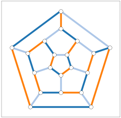

Graph Coloring You Can See
==========================

***Visual Intuition with Python***

**Author:** [Rhyd Lewis](https://rhydlewis.eu/), [Cardiff University](https://www.cardiff.ac.uk/)

# Introduction

Graph coloring is the computational task of assigning colors to elements
of a graph so that adjacent elements never share the same color. It has
applications in several domains, including [sports scheduling,
cartography, street map navigation, and timetabling](https://link.springer.com/book/10.1007/978-3-030-81054-2).
It is also of significant theoretical interest and a standard subject in
university-level courses on graph theory, algorithms, and combinatorics.

A graph is a mathematical structure comprising a set of *nodes* in which
some pairs of nodes are connected by *edges*. Given any graph,

-   A *node coloring* is an assignment of colors to nodes so that all
    pairs of nodes joined by edges have different colors,

-   An *edge coloring* is an assignment of colors to edges so that all
    edges that meet at a node have different colors,

-   A *face coloring* of a graph is an assignment of colors to the faces
    of one of its planar embeddings (if such an embedding exists) so
    that faces with common boundaries have different colors.

<div style="text-align:center;">
    
    
    
    <p>Optimal node, edge, and face colorings (respectively) of the dodecahedral graph.</p>
</div>

Examples of these concepts are shown in the images above. Observe that face
colorings require nodes to be arranged on the plane so that none of the
graph's edges intersect. Consequently, they are only possible for planar
graphs. In contrast, node and edge colorings are possible for all
graphs. The aim is to find colorings that use the minimum (optimum)
number of colors, which is an NP-hard problem in general.

In this article
we consider node, edge, and face colorings and seek to bring the topic
to life through detailed, visually engaging examples. To do this, we
make use of the newly created [GCol](https://gcol.readthedocs.io/en/latest/), library an
open-source Python library built on top of NetworkX. This library makes
use of both exponential-time exact algorithms and polynomial-time
heuristics.

The following Python code uses GCol to construct and visualize node,
edge, and face colorings of the graph seen above. A
full listing of the code used to generate the images in this article is
available [here](https://zenodo.org/records/18713618). An extended version of this article is also
available [here](https://arxiv.org/pdf/2602.18246v1).

``` {.python language="python" frame="single"}
import networkx as nx
import matplotlib.pyplot as plt
import gcol

G = nx.dodecahedral_graph()

# Generate and display a node coloring
c = gcol.node_coloring(G)
nx.draw_networkx(G, node_color=gcol.get_node_colors(G, c))
plt.show()

# Generate and display an edge coloring
c = gcol.edge_coloring(G)
nx.draw_networkx(G, edge_color=gcol.get_edge_colors(G, c))
plt.show()

# Generate node positions and then a face coloring
pos = nx.planar_layout(G)
c = gcol.face_coloring(G, pos)
gcol.draw_face_coloring(c, pos)
nx.draw_networkx(G, pos)
plt.show()
```

---

# Node Coloring

Node coloring is the most fundamental of the graph coloring problems.
This is because edge and face coloring problems can always be converted
into instances of the node coloring problem. Specifically:

-   An edge coloring of a graph can be achieved by coloring the nodes of
    its *line graph*,

-   A face coloring of a planar graph can be found by coloring the nodes
    of its *dual graph*.

Edge and face coloring problems are therefore *special cases* of the
node coloring problem, concerning line graphs and planar graphs,
respectively.

When visualizing node colorings, the spatial placement of the nodes
affects interpretability. Good node layouts can reveal structural
patterns, clusters, and symmetries, while poor layouts can obscure them.
One option is to use force-directed methods, which model nodes as
mutually repelling elements and edges as springs. The method then
adjusts the node positions to minimize an energy function, balancing the
attracting forces of edges and the repulsive forces from nodes. The aim
is to create an aesthetically pleasing layout where groups of related
nodes are close, unrelated nodes are separated, and few edges intersect.

<figure>
<embed src="images/random-random-node-sq.png" /> 
<embed src="images/random-spring-node-sq.png" /> 
<embed src="images/random-circle-node-sq.png" /> 
<embed src="images/random-multipartite-node-sq.png" />
<figcaption>Four ways of drawing the same node coloring.</figcaption>
</figure>

The colorings in the images above demonstrate the effects of different node
positioning schemes. The first example uses randomly selected positions,
which seems to give a rather cluttered diagram. The second example uses
a force-directed method (specifically, NetworkX's
`spring_layout()`{.python} routine), resulting in a more logical layout
in which communities and structure are more apparent. GCol also allows
nodes to be positioned based on their colors. The third image positions
the nodes on the circumference of a circle, putting nodes of the same
color in adjacent positions; the second arranges the nodes of each color
into columns. In these cases, the structure of the solution is more
apparent, and it is easier to observe that nodes of the same color
cannot have edges between them.

Node colorings are usually easier to display when the number of edges
and colors is small. Sometimes, the nodes also have a natural
positioning that aids interpretation. Examples of such graphs are shown
in the following images. The first three show examples of
bipartite graphs (graphs that only need two colors); the remainder 
show graphs that require three colors.

<figure>
<embed src="images/btree256-node-sq.png" />
<embed src="images/hex12x12-node-sq.png" />
<embed src="images/HoG-1122-node-sq.png" />
<embed src="images/triangle12x12-node-sq.png" /> 
<embed src="images/HoG-1347-node-sq.png" />
<embed src="images/HoG-51392-node-sq.png" />
<figcaption>Optimal node colorings of, respectively, a binary tree, a
hexagonal lattice, the great rhombicosidodecahedral graph, a triangular
lattice, the Thomassen graph, and the great rhombicosidodecahedral line
graph.</figcaption>
</figure>

---

# Edge Coloring

Edge colorings require all edges ending at a particular node to have a
different color. As a result, for any graph $G$ the minimum number of
colors needed is always greater than or equal to $\Delta(G)$, where
$\Delta(G)$ denotes the maximum [degree](https://en.wikipedia.org/wiki/Degree_(graph_theory))
in $G$. For bipartite graphs,
[Konig's theorem](https://en.wikipedia.org/wiki/K%C5%91nig%27s_theorem_(graph_theory))
 tells us that $\Delta(G)$ colors are always sufficient.
[Vizing's theorem](https://en.wikipedia.org/wiki/Vizing%27s_theorem) gives a more general result, stating that, for any graph
$G$, no more than $\Delta(G)+1$ colors are ever needed.

<figure>
<embed src="images/complete6-edge-sq.png" />
<embed src="images/HoG-1347-edge-sq.png" />
<embed src="images/HoG-1122-edge-sq.png" />
<figcaption>Optimal edge colorings for, respectively, a complete graph
on six nodes, the Thomassen graph, and the great rhombicosidodecahedral
graph.</figcaption>
</figure>

Edge coloring has applications in the construction of sports leagues,
where a set of teams are required to play each other over a series of
rounds. The first example above shows a complete graph on six nodes, one
node per team. Here, edges represent matches between teams, and each
color gives a single round in the schedule. Hence, the "dark blue" round
involves matches between Teams 0 and 1, 2 and 3, and 4 and 5, for
example. The other images above show optimal edge colorings of two of
the graphs seen earlier. These examples are reminiscent of crochet doily
patterns or, perhaps, Ojibwe dream catchers.

Edge colorings of two further graphs are shown below.
These help to illustrate how, using edge coloring, walks around a
graph can be specified by a starting node and a sequence of colors that
specify the order in which edges are then followed. This provides an
alternative way of specifying routes between locations in street maps.

<figure>
<embed src="images/cardiffstreets-edge-sq.png" />
<embed src="images/hex20x25-edge-sq.png" />
<figcaption>Optimal edge colorings of the street map of central Cardiff,
Wales (left) and the hexagonal lattice graph (right).</figcaption>
</figure>

---

# Face Coloring

The famous [four-color theorem](https://en.wikipedia.org/wiki/Four_color_theorem)
states that face colorings of planar
embeddings never require more than four colors. This phenomenon was
first noted in 1852 by Francis Guthrie while coloring a map of the
counties of England; however, it would take over 100 years of research
for it to be formally proved.

<figure>
<embed src="images/HoG-1122-face-sq.png" />
<embed src="images/HoG-1347-face-sq.png" />
<embed src="images/france-face-sq.png" />
<figcaption>Optimal face colorings of, respectively, the great
rhombicosidodecahedral graph, the Thomassen graph, and a map of the
administrative departments of France.</figcaption>
</figure>

The above images show face colorings of three graphs. Here,
nodes should be assumed wherever edges are seen to meet. In this figure,
the central face of the Thomassen graph illustrates why four colors are
sometimes needed. As shown, this central face is adjacent to five
surrounding faces. Together, these five faces form an odd-length cycle,
necessarily requiring three different colors, so the central face must
then be allocated to a fourth color. A fifth color will never be needed,
though.

Face colorings often need fewer than four colors, though. To demonstrate this,
here we consider a special type of graph known as Eulerian graph.
This is simply a graph in which the degrees of all nodes are even. A
planar graph is Eulerian if and only if its dual graph is bipartite;
consequently, the faces of Eulerian planar graphs can always be colored
using two colors. 

<figure>
<embed src="images/sierpinski4-face-sq.png" />
<embed src="images/HoG-1317-face-sq.png" />
<embed src="images/rectangles-face-sq.png" />
<figcaption>Two colors are always sufficient in face colorings of
Eulerian planar graphs. The first example shows the Sierpinski triangle
at four levels of recursion; the second shows the small
rhombicosidodecahedral graph; the third example is formed by overlaying
an arbitrary set of closed curves (rectangles here).</figcaption>
</figure>

Examples of this are shown above where, as required, all nodes have an even
degree. Practical examples of this theorem can be seen in chess boards,
Spirograph patterns, and many forms of Islamic and Celtic art, all of which feature
underlying graphs that are both planar and Eulerian. Common tiling
patterns involving square, rectangular, or triangular tiles are also
characterized by such graphs, as seen in the well-known "chequered"
tiling style.

Two further tiling patterns are shown below. 
The first uses hexagonal tiles, where the main body features a repeating pattern of three
colors. The second example shows an optimal coloring of a recently
discovered [aperiodic tiling pattern](https://www.maths.cam.ac.uk/features/tip-hat-celebrating-aperiodic-monotile-discovery). 
Here, the four colours are distributed in a less regular manner.

<figure>
<embed src="images/hex20x25-face-sq.png" />
<embed src="images/hattile16x16-face-sq.png" />
<figcaption>Optimal face colorings of, respectively, a hexagonal tiling
pattern and the aperiodic pattern formed by the "hat" tile.</figcaption>
</figure>

Our final example comes from an infamous [spoof article](http://www.pgccphy.net/1570/sciam-april-fools-1975.pdf) 
from a 1975 issue of *Scientific American*. One of the false claims made in this article was that a graph had been discovered whose faces needed
at least five colors, therefore disproving the four color theorem. This graph is shown below,
along with a four coloring. 

<figure>
<embed src="mcgregorgraph-face-sq.png" />
<figcaption>An optimal coloring the graph shown in an April Fool’s article of <em>Scientific
American</em> in 1975.</figcaption>
</figure>

---

# Conclusions and Further Resources

The article has reviewed and visualized several results from the field
of graph coloring, making use of the open-source Python library [GCol](https://gcol.readthedocs.io/en/latest/).
The library also includes methods for equitable coloring, weighted
coloring, precoloring, list coloring, and maximum independent set
identification. All source code used to generate the figures can be found [here](https://zenodo.org/records/18713618).

An extended version of this article can be found [here](https://arxiv.org/pdf/2602.18246v1).


